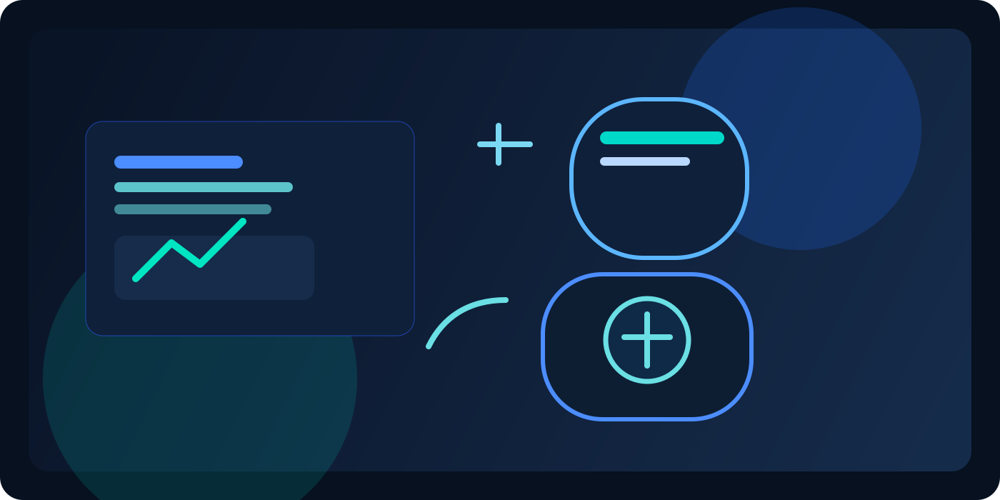

# 🧠 Clinical AI Copilot

<div align="center">



A next-generation clinical conversation intelligence platform that transforms live doctor-patient dialogue into structured, searchable, and actionable clinical insight.

[](https://www.python.org/)
[](https://fastapi.tiangolo.com/)
[](https://github.com/openai/whisper)
[](https://ollama.com/)
[](#rag--langgraph)
[](#rag--langgraph)

</div>

---

> This is a highly advanced Applied AI project that blends speech recognition, natural language processing, retrieval-augmented reasoning, and agent-style orchestration for real-world clinical workflows.

## ✨ Why this project stands out

- 🗣️ Converts live audio conversations into structured transcripts in real time
- 🧠 Extracts clinical entities, answers, and context from medical dialogue
- 🔎 Uses retrieval-augmented generation (RAG) to ground outputs in relevant knowledge
- 🧩 Applies LangGraph-inspired multi-step orchestration for reasoning workflows
- 🏥 Supports a practical path toward AI-assisted clinical decision support

## 🚀 What this system does

Clinical AI Copilot is designed to help bridge the gap between raw conversation and structured clinical understanding. The pipeline ingests audio, transcribes it, interprets meaning, and builds a richer state of the interaction over time.

### Core workflow

```text
Audio Stream → Speech Recognition → Transcript Event → Entity Extraction → Structured Answers → Clinical State Memory
```

## 🧠 Advanced AI capabilities

| Capability | Description |
| --- | --- |
| Speech-to-Text | Uses Whisper-based transcription for accurate spoken input processing |
| Clinical NLP | Extracts meaningful entities and relationships from dialogue |
| Conversation Memory | Tracks context across turns and speaker interactions |
| Structured Outputs | Produces normalized summaries and answer bundles |
| RAG | Retrieves and grounds insights using a retrieval layer over relevant knowledge |
| LangGraph-style Orchestration | Coordinates multi-step reasoning and stateful AI workflow execution |

## 🧱 Architecture overview

The project is organized around a modular pipeline:

- Audio ingestion and segmentation
- ASR transcription and timing alignment
- Cognitive processing and entity extraction
- Structured answer generation and summarization
- Persistent clinical state and conversation tracking

### High-level flow

```text
User/Clinician Audio
  ↓
Speech Segmenter
  ↓
Whisper ASR Engine
  ↓
Transcript Event
  ↓
Cognitive Processor + NLP Pipeline
  ↓
Structured Clinical State / Insights
```

## 🔎 RAG & LangGraph

This project is built around modern Applied AI concepts that make it more than a simple chatbot:

- 🧠 RAG: retrieval-augmented generation is used to enrich responses with relevant context rather than relying only on model memory
- 🧩 LangGraph-style orchestration: the workflow is designed to support multi-step reasoning, state persistence, and conditional progression between AI stages
- 🏗️ Applied AI focus: the system combines speech AI, language AI, structured memory, and retrieval into a real-world use case

## 🧪 Features

- Real-time audio event handling
- Speaker-aware transcript processing
- Entity extraction from conversational text
- Summarization of clinical answers
- Context window management across sessions
- Modular support for LLM and retrieval services

## 📁 Project structure

```text
Clinical-AI-Copilot/
├── central_server/
│   ├── asr/
│   ├── cognition/
│   ├── conversation/
│   ├── llm/
│   ├── memory/
│   ├── nlp/
│   ├── pipeline/
│   └── rag/
├── endpoint_node/
├── modules/
├── model/
├── assets/
├── requirements.txt
└── README.md
```

## ⚙️ Quick start

1. Clone the repository
2. Create and activate a Python environment
3. Install dependencies

```bash
pip install -r requirements.txt
```

4. Start the FastAPI server

```bash
uvicorn central_server.main:app --reload
```

> Ensure any required local LLM or Ollama services are running before executing the workflow.

## 🛣️ Roadmap

- Expand retrieval quality for deeper clinical grounding
- Strengthen entity and ontology mapping
- Improve conversation state reasoning and summarization
- Add richer agent workflows and evaluation pipelines
- Prepare deployment-ready healthcare-focused interfaces

## 🤝 Contact

If you want to collaborate or discuss this project, feel free to connect.

- GitHub: [kalpthakkar](https://github.com/kalpthakkar)
- Email: [kalpthakkar2001@gmail.com](mailto:kalpthakkar2001@gmail.com)

---

<p align="center"><strong>✨ Built as an advanced Applied AI system for clinical understanding and intelligent assistance. ✨</strong></p>
